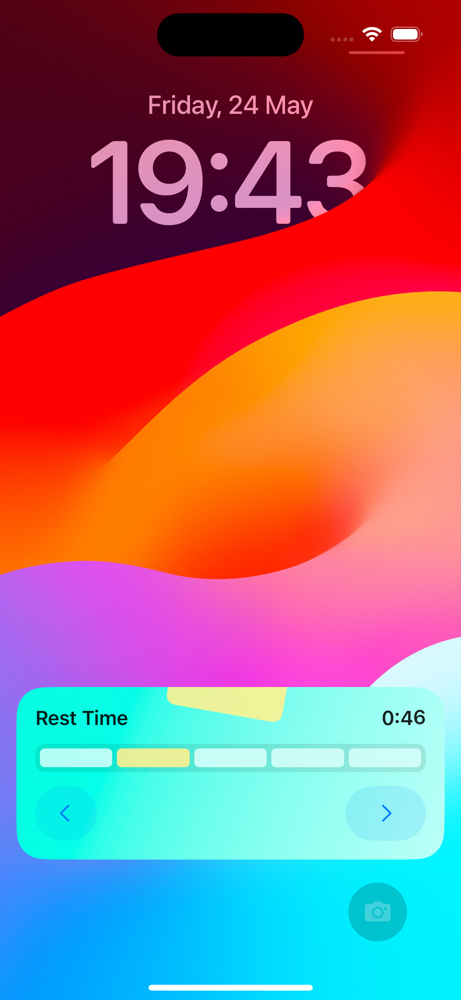
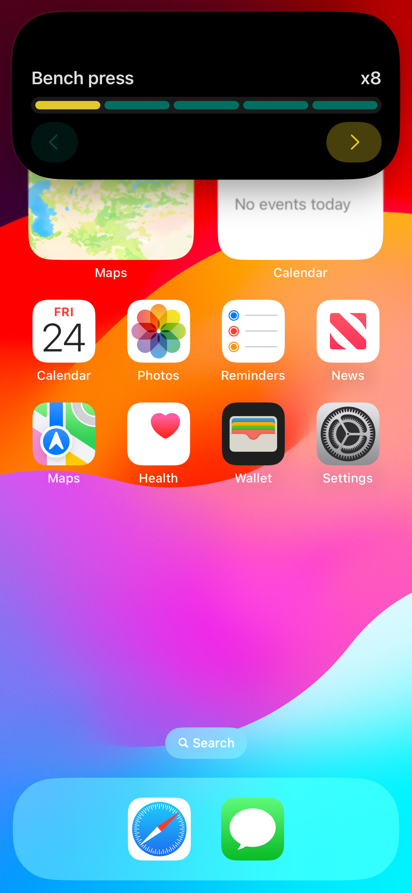
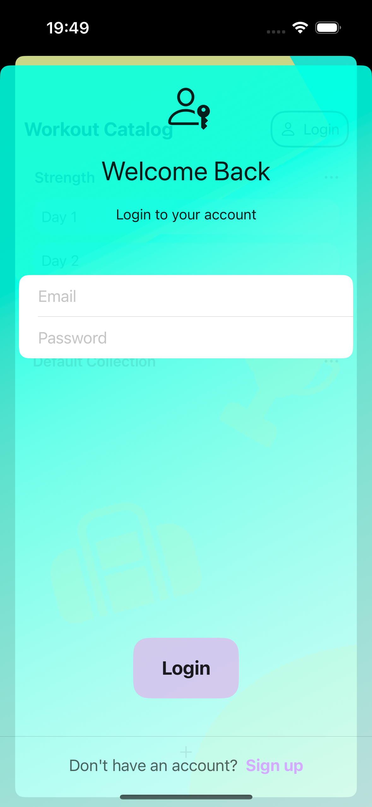

#  SweatSketch: Sketch, Sweat, and Succeed
The “SweatSketch: Sketch, Sweat, and Succeed” is a lightweight app for taking gym notes about the workout programs and weight-lifting results.

## Demo GIF
  App demo

## Concept
I haven’t conducted any marketing research since this is a playground project. It covers only my needs as a sole user. I started this project in 2021 with an iOS14 target. When I resurrected it in early 2024, I decided not to update the target, as in a corporate environment, you have to support the largest number of devices possible or deal with legacy code. It allows me to follow the SwiftUI evolution and search for workarounds without using new modifiers or classes.

A workout contains exercises, which consist of actions. Actions have a type: sets-n-reps and timed. Sets-n-reps actions later will include weight type information: dumbbell, barbell, machine, body. The weight type input will streamline the result logging flow.

The app supports workout plans like the following one. 

> 10 min treadmill run  
1x12, 1x10, 1x8 benchpress  
3x12 incline dumbbell press  
(superset, 3 times) 3 min treadmill + 12 deadlift + max lat pulldowns + 5 burpees 

The user can add rest times between actions and exercises. It can be either default for the whole workout and automatically applied between each exercise and action or customized for each exercise.

Once the user has planned the workout, they press the big ‘Go’ button, and the app switches to workout executing mode. That mode allows ticking exercise actions as done, observing the rest or timed action timer, and, in future updates, logging lifted weights by their type.  
Active workout action is displayed on Dynamic Island and as a LiveActivity. Ultimately, I’ll add an Apple Watch part to manage the active workout. 

After finishing the workout, users will be able to check the fitness dashboard. It’s up in the air, but each entity has its UUID, allowing us to gather the required data.

## Technical Stack
- SwiftUI for the UI views layer with UIKit-based navigation
- CoreData and UserDefaults
- Combine
- ActivityKit
- CocoaPods

## App Navigation and Architecture
The application follows the MVVM-C approach except for omitting dedicated Model files duplicating CoreData entities.  
A coordinator pattern is implemented for navigation among SwiftUI views. SwiftUI’s @app calls a UIViewControllerRepresentable of the application root UINavigationController. ‘Application Coordinator’ appends child coordinators for every app module. Coordinators stack SwiftUI views wrapped in a UIHostingController and manage presented screens. That's the most comfortable way to use UIKit navigation while being supported with SwiftUI declarative syntax and previews. Not to mention, this approach will allow you to inject ViewControllers shared from the Multiplatform repository.  
Data is managed and passed through ViewModels, including temporary ViewModels for editing states. Nested ViewModels have nested NSManagedContexts, allowing scratchpad functionality and supporting undo-redo operations.  
The app uses Combine to switch modes and update receive updates from LiveActivity and Dynamic Island.  
UserDefaults stores information about an active workout to support state restoration.  
Network calls and related logic are encapsulated in the Shared Kotlin Multiplatform Library injected as Pod (see SweatSketchShared repository). Prior to that, I used URLSession.  
I implemented the delegate pattern for UserProfile to get some experience with it, so navigation among views in that part is slightly different from the rest of the app.  

## Miscellaneous Features
The app supports light and dark color schemes inherited from system preferences.  
The app supports English, Russian, and German languages. Available for iOS16+  

## Screenshot Gallery
| | |
| :---: | :---: | 
|   Workout Carousel |   Workout Edit |
|   Exercise Edit |   Active Workout |
|   Activity |   Dynamic Island |
|   Workout Catalog |   Login, Signup |

## Notes
Update Podfile with path to shared framework location
